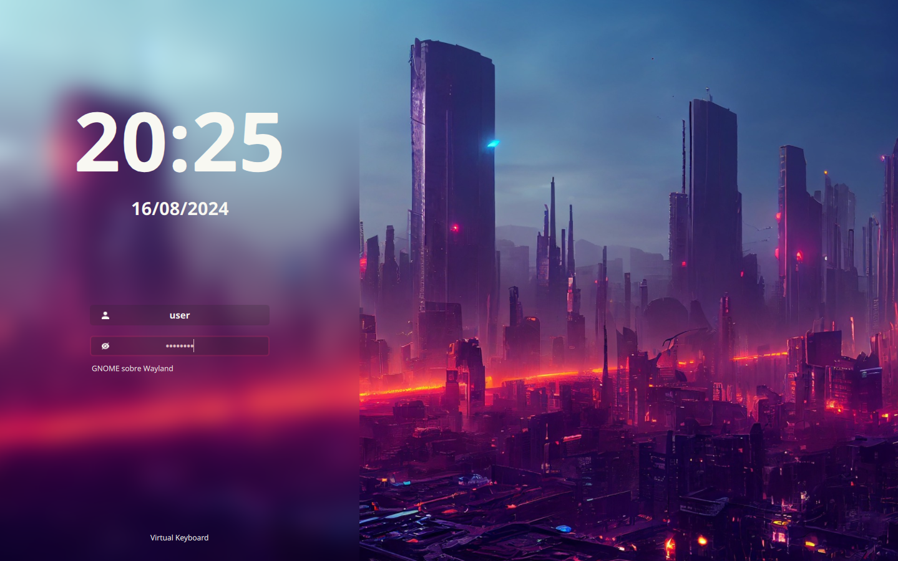
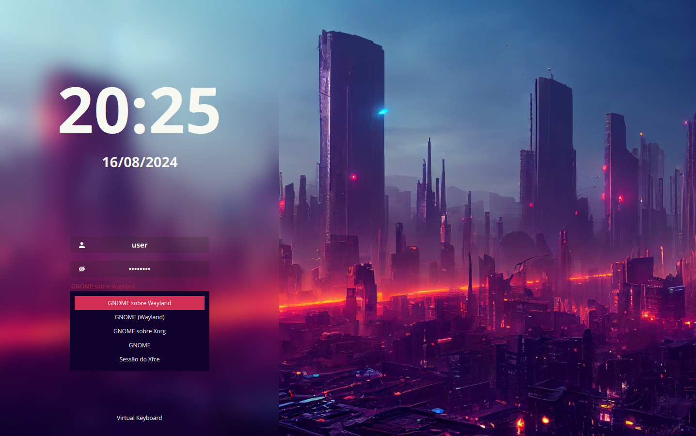

# sddm-cyberpunk-theme

A theme for the [SDDM login manager](https://github.com/sddm/sddm).

- Screen resolution: 1080p
- Font: Open sans

### Preview

You can easily change how it looks in **[config](./theme.conf)**. 
Here are some examples:




### Dependencies

```sh
qt6-5compat qt6-declarative qt6-svg sddm
```

### Install

Clone this repository, copy fonts to `/usr/share/fonts/`:

   ```sh
   sudo git clone https://github.com/paulocfrossard/sddm-cyberpunk-theme /usr/share/sddm/themes/sddm-cyberpunk-theme
   sudo cp /usr/share/sddm/themes/sddm-cyberpunk-theme/Fonts/* /usr/share/fonts/
   ```

### Set locale

    Edit locate in /usr/share/sddm/themes/sddm-cyberpunk-theme/theme.conf

    ```sh
    sudo vim /usr/share/sddm/themes/sddm-cyberpunk-theme/theme.conf
    ```

    Edit youLocale, use [doc QT](https://doc.qt.io/qt-5/qlocale.html#Country-enum)

    ```conf
        Locale="youLocale"
    ```
    Save and test

### Test

    ```sh
    sddm-greeter-qt6 --test-mode --theme /usr/share/sddm/themes/sddm-cyberpunk-theme
    ```

### Aplly
Then edit `/etc/sddm.conf`, so that it looks like this:

    ```sh
    echo "[Theme]
    Current=sddm-cyberpunk-theme" | sudo tee /etc/sddm.conf
    ```

### Credits

Based on the theme [`Sugar Dark for SDDM`](https://github.com/MarianArlt/sddm-sugar-dark) by **MarianArlt**.
Based on the theme ['sddm-astronaut-theme'](https://github.com/Keyitdev/sddm-astronaut-theme) by **Keyitdev**

### License

Distributed under the **[GPLv3+](https://www.gnu.org/licenses/gpl-3.0.html) License**.    
Copyright (C) 2022-2024 Keyitdev.